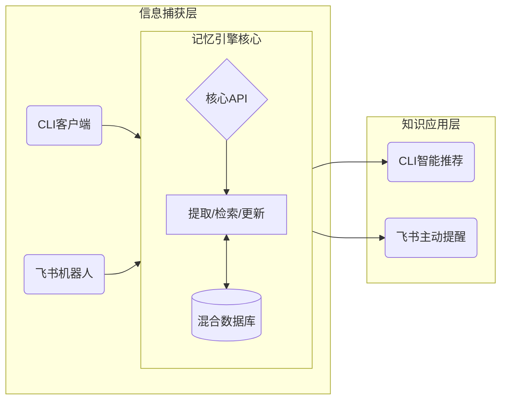

# 🧠 企业级记忆引擎 (Enterprise Memory Engine)

<p align="center">
  
  
  
</p>

> **一个能跨越CLI与飞书，沉淀、唤醒、复用碎片化知识的“外置大脑”。**

---

## 🤯 痛点：我们是否在“集体失忆”？

在日常的开发与协作中，有价值的信息正在不断流失：

- **对于开发者**: 那些复杂的、偶尔使用的、与特定项目相关的**命令行**，你是否需要反复查阅笔记或 `history`？
- **对于团队**: 那些在**飞书群聊**中一闪而过的关键决策、技术方案、客户反馈，是否在一周后就无人记起，导致重复讨论和无效沟通？

信息被隔离在不同的工具中，并随着时间被遗忘。我们正在为此付出高昂的效率成本。

## 💡 方案：构建一个记忆引擎

本项目旨在构建一个统一的记忆引擎，通过不同的“探针”捕获信息，经过智能处理后存入“记忆宫殿”，并在最需要的时刻被主动唤醒。



## 🚀 快速上手 (Quick Start)

只需3个步骤，即可在本地运行并使用记忆引擎。

### 1. 环境准备

- Python 3.10+ & Pip
- Git

### 2. 安装与配置

```bash
# 克隆项目到本地
git clone <your-repo-url>
cd feishu-long-memory-agent

# 安装项目本身及所有依赖
# '-e' 表示可编辑模式，你的代码修改会立刻生效
pip install -e .

# [重要] 为全局 aem 命令配置后端地址（首次使用需要）
mem configure
# > 根据提示输入后端API地址，默认为 http://localhost:8000/api/v1
```

### 3. 启动服务

```bash
# (可选) 如果你修改了.env.example, 复制一份
# cp .env.example .env

# 初始化数据库（首次运行需要）
python init_db.py

# 启动后端API服务
uvicorn backend.main:app --reload --port 8000
```

服务启动后，你就可以在**任意终端**使用 `mem` 命令，或在飞书中与机器人互动了。

## � 使用指南 (Usage)

### CLI端：开发者的“第二大脑”

`mem` 命令现在是你的全局效率工具。

```bash
# 场景1: 记住一个复杂的命令，并打上标签
mem memorize "docker run -p 8080:80 -v /data:/app/data --name webapp my-image:1.2" --type "docker启动命令"

# 场景2: 当忘记时，通过自然语言模糊搜索
mem search "启动webapp容器"

# 场景3: 查看最近记住的所有内容
mem list

# 场景4: 清空所有记忆
mem clear
```

### 飞书端：团队的“决策账本”

1.  **储存决策**
    - **你** (在群聊中): `@记忆机器人 记住，alpha版的发布日期最终定在5月10日。`
    - **机器人** (自动回复): `好的，我记住了：alpha版发布日期 -> 5月10日。`

2.  **自动唤醒**
    - **同事** (几天后在群聊中): `我们项目啥时候发版来着？`
    - **机器人** (主动推送卡片): 
        > **历史决策提醒**
        > **主题**: alpha版发布日期
        > **结论**: 5月10日
        > **记录时间**: 2024-05-01

## 🛠️ 技术内幕 (Under the Hood)

- **后端**: FastAPI, Uvicorn
- **数据存储**: SQLAlchemy, ChromaDB (向量库), SQLite/PostgreSQL
- **AI能力**: LangChain, OpenAI API
- **CLI**: Typer
- **飞书集成**: 官方 Python SDK

项目采用分层解耦架构，核心业务逻辑与接入端无关，具备高度可扩展性，为未来接入更多记忆场景（如个人偏好学习、知识遗忘预警）奠定了坚实基础。

## 🤝 贡献与开发

我们欢迎任何形式的贡献！无论是功能建议、Bug修复还是文档改进。

1.  Fork 本仓库
2.  创建你的特性分支 (`git checkout -b feature/AmazingFeature`)
3.  提交你的修改 (`git commit -m 'Add some AmazingFeature'`)
4.  推送到分支 (`git push origin feature/AmazingFeature`)
5.  发起一个 Pull Request

## 📄 许可证

本项目采用 [MIT](LICENSE) 许可证。
