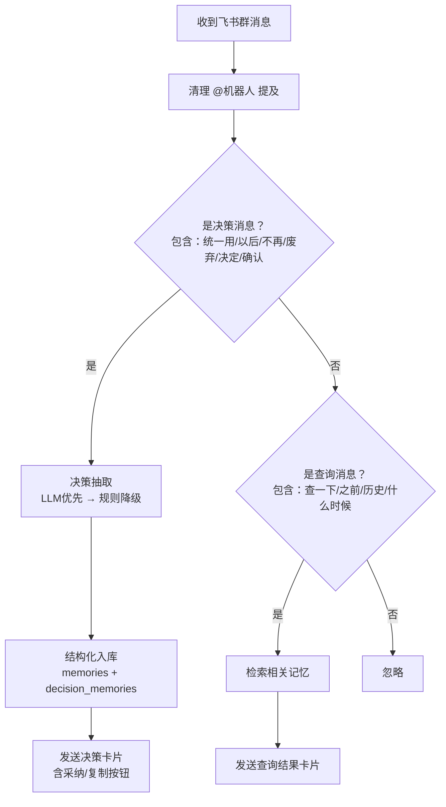
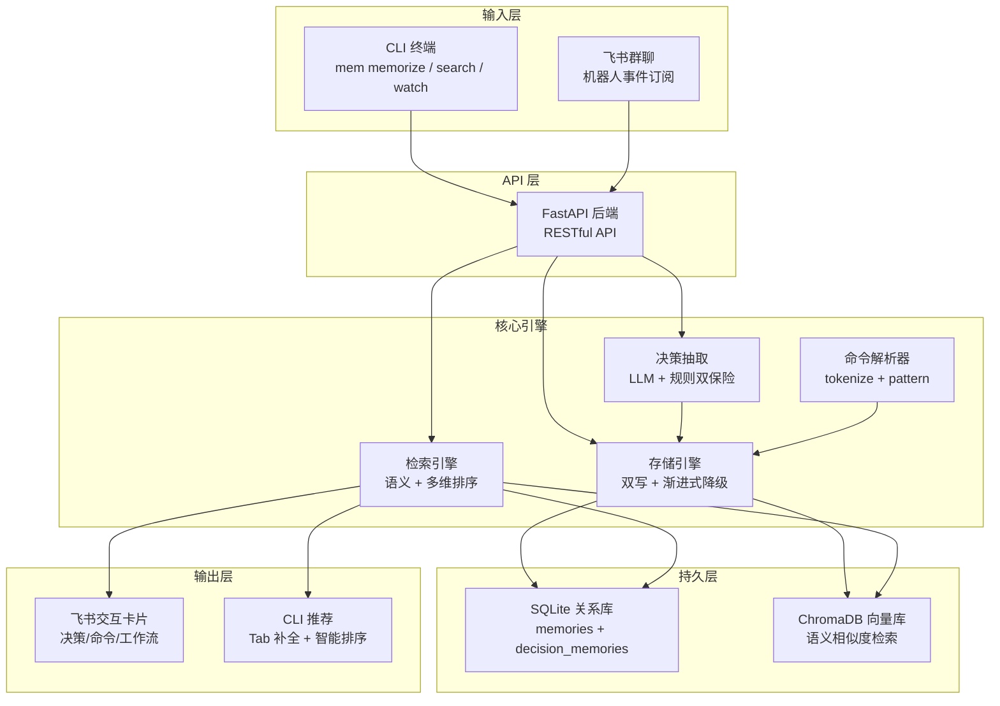
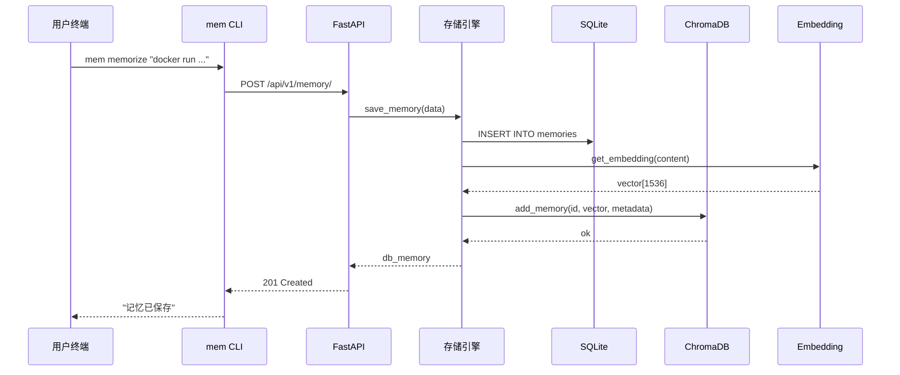
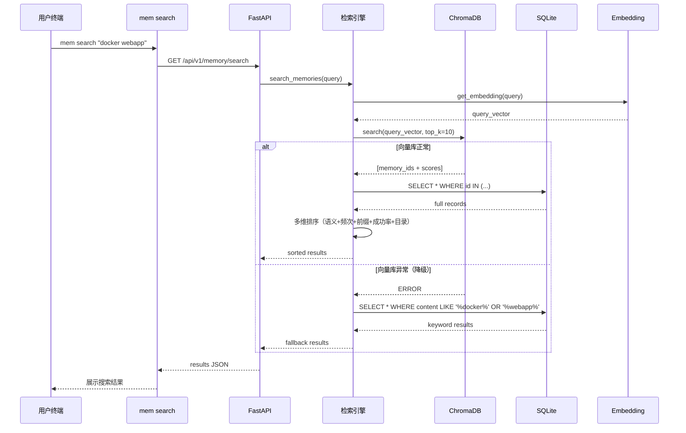
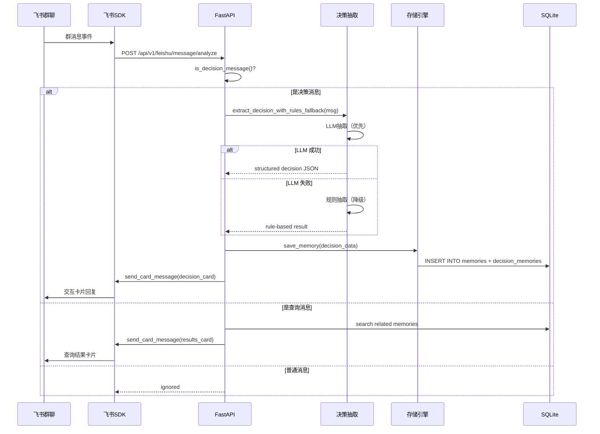
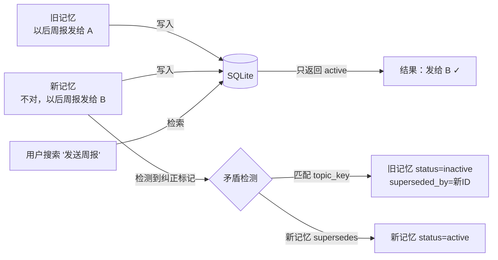

# Memory 定义与架构白皮书

> 飞书AI校园大赛参赛作品 — 企业级长期记忆引擎

---

## 一、记忆场景定义

### 1.1 为什么企业需要"记忆"？

在日常研发和团队协作中，大量有价值的信息散落在聊天记录、终端历史、文档角落里，随着时间推移被遗忘。典型痛点：

- **CLI 命令遗忘**：开发者反复输入相同的长命令（如 `docker run -p 8080:80 -v /data:/app/data --name webapp my-image:1.2`），每次都要翻历史记录或文档。
- **决策丢失**：团队在飞书群里达成的共识（"以后部署用 prod 不用 staging"），新人入群后无从得知，老成员也可能遗忘。
- **偏好散落**：个人的工作习惯和配置偏好（"周报发给 B 而不是 A"）没有统一的记录渠道。

本系统将这些信息统一抽象为 **Memory（记忆）**，并提供结构化的写入、检索、更新和淘汰机制。

### 1.2 面向开发者的 CLI 记忆

CLI 方向解决的核心问题：**开发者反复输入相同的长命令，效率低下且容易出错**。

**典型场景**：
- 运维工程师每天要输入 `docker run -p 8080:80 -v /data:/app/data --name webapp my-image:1.2` 这样的长命令
- 排查问题时需要翻阅历史记录找 `kubectl logs deploy/api-server -n prod --tail=200 -f`
- 备份数据库的命令参数复杂，每次都要查文档

**CLI 提供的核心能力**：

| 命令 | 功能 | 说明 |
|------|------|------|
| `mem memorize <content>` | 显式注入记忆 | 将命令保存到记忆系统 |
| `mem search <query>` | 语义搜索 | 用自然语言描述意图，找到最匹配的命令 |
| `mem watch` | 自动扫描 | 扫描 shell 历史，自动记录高频命令 |
| `mem suggest <prefix>` | 前缀推荐 | 输入前缀，返回智能排序的推荐列表 |
| `mem workflow save/run` | 工作流 | 保存和执行多步命令序列 |
| `mem completion install` | Tab 补全 | 为 PowerShell/Bash/Zsh 安装自动补全 |
| `mem clear` | 清空记忆 | 真实删除关系库和向量库中的所有记忆 |

**CLI 记忆的元数据**：
- `count`：命令被记录的次数
- `success_count` / `failure_count`：执行成功/失败次数
- `shell`：来源 shell 类型（powershell/bash/zsh）
- `directory` / `directories`：命令执行的目录上下文
- `command_pattern`：解析后的命令模式（program + flags + positionals）

### 1.3 面向团队的飞书记忆机器人

飞书方向解决的核心问题：**团队决策散落在聊天记录中，新人无从得知，老人也会遗忘**。

**典型场景**：
- 团队在飞书群里讨论后达成共识"以后部署用 prod 不用 staging"，但这条决策淹没在几百条消息里
- 新成员入群后不知道团队已经废弃了某个工具，还在用旧方案
- "周报以后发给 B" 这样的偏好变更没有正式记录

**飞书机器人的核心能力**：

| 能力 | 触发方式 | 说明 |
|------|---------|------|
| **决策自动沉淀** | 群消息包含决策关键词 | 检测到"统一用"、"以后"、"不再使用"等关键词时，自动抽取决策并入库 |
| **决策结构化抽取** | LLM + 规则双保险 | 从自然语言中提取 topic、conclusion、reason、project、preferred/rejected terms、deadline |
| **交互卡片回复** | 决策/查询消息 | 自动回复飞书交互卡片，支持按钮操作（复制命令、执行命令、确认采纳） |
| **历史记忆查询** | 群消息包含查询关键词 | 检测到"查一下"、"之前"、"历史"等关键词时，检索相关记忆并返回卡片 |
| **矛盾自动覆写** | 新决策覆盖旧决策 | 新决策自动将旧决策标记为 inactive，确保团队始终执行最新决策 |
| **跨域影响** | 飞书决策 → CLI 推荐 | 飞书中确认"用 prod"后，CLI 的 `mem suggest` 也会优先展示 prod 相关命令 |

**飞书消息路由逻辑**：



**飞书交互卡片类型**：

| 卡片类型 | Header 颜色 | 包含信息 | 操作按钮 |
|---------|------------|---------|---------|
| 决策卡片 | 蓝色 | topic、conclusion、reason、project、deadline | 采纳、复制结论 |
| CLI 命令卡片 | 绿色 | 命令内容、使用频次、成功率、目录 | 复制命令、执行命令 |
| 工作流卡片 | 紫色 | 工作流名称、步骤列表 | 执行工作流 |

**飞书 SDK 集成方案**：
- 使用飞书官方 `lark-oapi` Python SDK
- 支持 WebSocket 长连接（本地开发无需公网地址）
- 消息发送支持交互卡片，失败时自动降级为纯文本

### 1.4 三大记忆场景汇总

| 场景 | 来源 | 记忆类型 | 典型示例 |
|------|------|---------|---------|
| **CLI 高频命令** | 终端历史 / 手动注入 | `cli_command` | `docker run -p 8080:80 ...` |
| **项目决策历史** | 飞书群聊 | `project_decision` | "以后部署用 prod，废弃 staging" |
| **个人偏好** | CLI / 飞书 | `user_preference` | "周报发给 B" |

每条记忆包含以下核心字段：

| 字段 | 说明 |
|------|------|
| `id` | 16 位 UUID，全局唯一 |
| `content` | 记忆的原始内容（命令文本 / 决策描述） |
| `type` | 记忆类型：`cli_command` / `project_decision` / `user_preference` |
| `source` | 来源渠道：`cli` / `feishu_group` |
| `memory_metadata` | JSON 格式的扩展元数据（使用频次、目录上下文、决策术语等） |
| `hit_count` | 被检索命中的累计次数 |
| `created_at` / `updated_at` | 时间戳 |
| `expire_at` | 过期时间（默认 30 天） |

对于项目决策，额外关联 `DecisionMemory` 表，存储结构化的 `topic`（主题）、`conclusion`（结论）、`reason`（原因）、`deadline`（截止日期）。

---

## 二、系统架构

### 2.1 整体架构图



### 2.2 分层职责

| 层级 | 模块 | 职责 |
|------|------|------|
| **输入层** | CLI 终端、飞书群聊 | 接收用户输入，统一转换为内部格式 |
| **API 层** | FastAPI 后端 | 路由分发、参数校验、鉴权 |
| **核心引擎** | 存储引擎 | 双写关系库+向量库，渐进式降级 |
| | 检索引擎 | 语义检索 + 多维排序（相似度/频次/前缀/成功率/目录） |
| | 决策抽取 | LLM 语义抽取 + 规则正则抽取，自动降级 |
| | 命令解析器 | Shell 命令 tokenization，提取 program/flags/paths |
| **持久层** | SQLite | 结构化存储，支持复杂查询和事务 |
| | ChromaDB | 向量存储，支持语义相似度检索 |
| **输出层** | 飞书卡片 | 交互式卡片，支持按钮操作 |
| | CLI 推荐 | Tab 补全、智能排序建议 |

---

## 三、数据流向

### 3.1 CLI 命令记忆写入流程



### 3.2 记忆检索流程（带渐进式降级）



### 3.3 飞书决策沉淀流程



### 3.4 矛盾更新数据流



---

## 四、核心机制详解

### 4.1 双库存储与渐进式降级

系统采用 **关系库（SQLite）+ 向量库（ChromaDB）** 的双写架构：

- **关系库**是唯一的数据真相源（Source of Truth），存储完整的记忆记录和结构化字段。
- **向量库**用于语义相似度检索，是关系库的增强索引。
- 当向量库不可用时（网络异常、服务崩溃、路径权限问题），系统自动降级：记忆仍然成功保存到关系库，`vector_status` 标记为 `error`，后续检索回退到关键词匹配。

```python
# 核心降级逻辑（core/storage.py）
try:
    embedding = get_embedding(content)
    vector_client.add_memory(id, content, embedding, metadata)
    vector_status = "ok"
except Exception:
    vector_status = "error"  # 降级：向量库写入失败，关系库仍可用
```

### 4.2 矛盾更新机制

当用户输入包含纠正标记（`不对`、`更正`、`改成`、`以后用`、`不再使用`）时，系统自动触发矛盾检测：

1. 从新记忆中提取 `topic_key`（基于 project 字段或内容关键词）
2. 查找同 `topic_key` 的旧记忆
3. 将旧记忆标记为 `status: inactive`，`superseded_by` 指向新记忆
4. 新记忆的 `supersedes` 字段记录被覆盖的旧记忆 ID
5. 检索时只返回 `status: active` 的记忆

### 4.3 多维排序算法

CLI 命令检索结果的排序综合考虑以下维度：

| 维度 | 权重 | 说明 |
|------|------|------|
| 语义相似度 | 基础分 | 向量余弦相似度 |
| 前缀匹配 | +0.2 | 查询是否是命令的前缀 |
| 使用频次 | +0.0 ~ +0.3 | `hit_count` 越高加分越多，上限 0.3 |
| 成功率 | +0.0 ~ +0.2 | `success_count / (success + failure)` |
| 时间衰减 | +0.0 ~ +0.2 | 越近的记忆加分越多 |
| 目录上下文 | 加分 | 当前目录与记忆目录匹配时加分 |

### 4.4 决策抽取双保险

飞书群消息中的决策抽取采用 **LLM 优先 + 规则兜底** 的双保险机制：

| 优先级 | 方法 | 优势 | 劣势 |
|--------|------|------|------|
| 1 | LLM 语义抽取 | 理解复杂语境，支持模糊表达 | 依赖外部 API，有延迟 |
| 2 | 规则正则抽取 | 零延迟，无外部依赖 | 只能匹配预定义模式 |

**LLM 抽取流程**：
1. 将消息填入结构化 Prompt（含 3 个示例）
2. 调用 OpenAI Chat API（temperature=0.1，确保稳定性）
3. 解析返回的 JSON，通过 `_normalize_result()` 规范化字段
4. 失败时自动降级为规则抽取

**规则抽取流程**：
1. 通过 `DECISION_MARKERS`（`统一用|以后用|不再使用|废弃|决定|确认`）判断是否为决策消息
2. 通过正则提取 `project`（`project-x` 格式或已知服务名）
3. 通过 `PREFERRED_MARKERS`（`统一用|改成|改用|发给`）提取推荐术语
4. 通过 `REJECTED_MARKERS`（`不再使用|废弃|不用|不发给`）提取废弃术语
5. 通过 `extract_deadline()` 提取截止日期（支持 ISO/中文/相对日期）

**抽取结果结构**：

| 字段 | 类型 | 说明 |
|------|------|------|
| `is_decision` | bool | 是否为决策消息 |
| `topic` | string | 决策主题（如"部署环境选择"） |
| `conclusion` | string | 决策结论（如"统一用 prod"） |
| `reason` | string | 决策原因（可选） |
| `project` | string | 相关项目（可选） |
| `preferred_terms` | list | 推荐术语列表（如 `["prod"]`） |
| `rejected_terms` | list | 废弃术语列表（如 `["staging"]`） |
| `deadline` | string | 截止日期 YYYY-MM-DD（可选） |
| `confidence` | float | 置信度 0.0-1.0 |

### 4.5 飞书消息路由与卡片生成

飞书机器人收到群消息后，按以下优先级路由：

1. **决策消息**（`is_decision_message()` 返回 True）→ 抽取决策 → 入库 → 发送决策卡片
2. **查询消息**（`is_query_message()` 返回 True）→ 检索记忆 → 发送查询结果卡片
3. **普通消息** → 忽略（不消耗资源）

**卡片模板系统**（`feishu_bot/card_templates.py`）：
- `decision_card(topic, conclusion, reason, project, deadline)` → 蓝色 Header 的决策卡片
- `cli_command_card(content, count, success_rate, directory)` → 绿色 Header 的命令卡片
- `workflow_card(name, steps)` → 紫色 Header 的工作流卡片
- `memory_to_card(memory)` → 根据 type 字段自动路由到对应卡片生成函数
- `cards_to_text(cards)` → 卡片发送失败时的文本降级方案

**SDK 消息发送**（`feishu_bot/sdk_messages.py`）：
- `send_interactive_message(chat_id, card_json)` → 发送交互卡片
- `send_card_message(chat_id, card_json)` → 带降级的卡片发送（失败 → 文本）
- `send_text_message(chat_id, text)` → 纯文本发送

### 4.6 跨域记忆联动

CLI 和飞书共享同一个 `memories` 表和向量集合，实现跨域记忆联动：

**飞书 → CLI**：
- 飞书群中确认"以后部署用 prod" → 记忆入库
- CLI 执行 `mem suggest deploy` → 检索时读取 `project_decision` 记忆
- 推荐结果中 prod 相关命令被上浮，staging 相关命令被降权

**CLI → 飞书**：
- CLI 中高频使用的命令 → 记忆入库（`type=cli_command`）
- 飞书群中有人问"我们用什么命令看日志" → 检索时命中 CLI 命令记忆
- 返回 CLI 命令卡片，团队成员可直接复制使用

---

## 五、记忆的商业价值

### 5.1 CLI 方向：开发者效率提升

| 指标 | 无记忆系统 | 有记忆系统 | 提效 |
|------|-----------|-----------|------|
| 输入字符数 | 62.5 字符/次 | 11.9 字符/次 | **80.3%** |
| 操作步数 | 4.9 步/次 | 2.1 步/次 | **58.0%** |
| 完成耗时 | 41.6 秒/次 | 9.1 秒/次 | **78.2%** |

**CLI 方向的核心价值**：
- **命令记忆**：不再反复输入长命令，用自然语言搜索即可
- **高频命令自动发现**：`mem watch` 自动扫描 shell 历史，无需手动记忆
- **智能排序**：综合语义相似度、使用频次、成功率、目录上下文等多维度
- **工作流复用**：将多步操作保存为工作流，一键执行
- **Shell 补全**：Tab 键自动补全，体验接近专业 CLI 工具

### 5.2 飞书方向：团队知识沉淀

**飞书方向的核心价值**：
- **决策自动沉淀**：团队决策从聊天记录中自动提取，不再淹没在消息流中
- **结构化存储**：每条决策包含 topic、conclusion、reason、project、deadline，可查询可追溯
- **新人快速上手**：新人入群后查询"我们用什么环境部署"，即可获得最新决策
- **矛盾自动检测**：新决策自动覆盖旧决策，避免团队执行过时的指令
- **交互卡片**：飞书卡片支持按钮操作，一键复制命令或确认采纳

**飞书方向的典型使用场景**：

| 场景 | 触发消息 | 系统行为 |
|------|---------|---------|
| 部署环境决策 | "以后 project-a 统一用 prod 部署，不再使用 staging" | 抽取决策 → 入库 → 发送蓝色决策卡片 |
| 周报偏好变更 | "周报以后发给 B，不再发给 A" | 抽取偏好 → 入库 → 旧偏好自动失效 |
| 历史决策查询 | "查一下我们之前用什么数据库" | 检索相关记忆 → 发送查询结果卡片 |
| 截止日期提醒 | "5月10日前完成数据库迁移" | 抽取 deadline → 入库 → 卡片显示截止日期 |

### 5.3 跨域联动价值

CLI 和飞书共享记忆池，产生 **1+1>2** 的协同效应：

- **飞书决策影响 CLI 推荐**：飞书中确认"用 prod"后，CLI 推荐自动上浮 prod 命令
- **CLI 命令反哺飞书查询**：飞书群中问"怎么看日志"，可返回 CLI 中记录的 `kubectl logs` 命令
- **统一记忆视图**：`mem list` 可查看所有来源的记忆，包括 CLI 注入和飞书决策

### 5.4 运维安全保障

- **命令记忆防误操作**：记住正确的生产环境命令，避免误用 staging 环境的命令。
- **操作可审计**：所有命令的执行结果（成功/失败）都记录在案。
- **渐进式降级**：即使向量库故障，核心记忆功能不受影响。
- **决策可追溯**：每条决策记录来源（飞书群聊）、时间、相关人员，支持事后审计。

---

## 六、技术选型理由

| 组件 | 选型 | 理由 |
|------|------|------|
| Web 框架 | FastAPI | 异步高性能，自动生成 OpenAPI 文档 |
| 关系库 | SQLite | 零配置，单文件部署，适合中小规模 |
| 向量库 | ChromaDB | 轻量级，支持持久化，Python 原生 |
| Embedding | OpenAI text-embedding-ada-002 | 1536 维，中英文效果好 |
| CLI 框架 | Typer | 类型注解驱动，自动生成帮助信息 |
| 飞书 SDK | lark-oapi | 官方 SDK，支持长连接和卡片消息 |
| ORM | SQLAlchemy | 成熟稳定，支持多种数据库后端 |

---

## 七、总结

本系统将企业协作中的碎片化信息（CLI 命令、团队决策、个人偏好）统一抽象为结构化的 Memory，通过双库存储、语义检索、矛盾更新、渐进式降等核心机制，实现了一个健壮、可用、可扩展的企业级长期记忆引擎。

核心设计原则：
1. **关系库为王**：向量库是增强，不是依赖
2. **渐进式降级**：任何组件故障都不应阻断核心功能
3. **时序感知**：新信息自动覆盖旧信息，保持记忆的时效性
4. **多维排序**：语义相似度只是维度之一，频次、前缀、成功率同样重要
